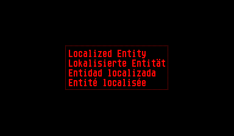

Uses an AninmatedActor to implement localized visual elements, where each animation represents one translation to another language. 

## Usage

Set up your Actor of type `LocalizedActor`. This plugin comes with a pre-defined AnimationFunction `LocalizedActorAnimation`, which you can use.
