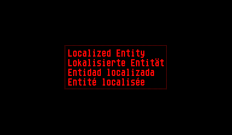

VUEngine Plugin: LocalizedEntity
================================

Uses an AninmatedEntity to implement localized visual elements, where each animation represents one translation to another language. 

USAGE
-----

Set up your Entity of type `LocalizedEntity`. This plugin comes with a pre-defined AnimationDescription `LOCALIZED_ENTITY_ANIM`, which you can use.
