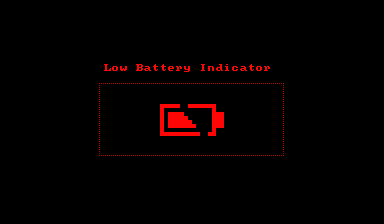

VUEngine Components: LowBatteryIndicatorEntity
==============================================

Shows a blinking low battery indicator on screen when the system power is low.

Uses an entity to do so. If you want to save the extra World needed, you can instead use the `vuengine-components/other/LowBatteryIndicator` component, which makes use of the printing layer instead.

USAGE
-----

Add the following to the COMPONENTS variable in your project's `config.make` file to include this component:

	vuengine-components/entities/LowBatteryIndicatorEntity 

Add `LOW_BATTERY_INDICATOR_LB` to your game's stages.
