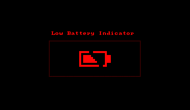

VUEngine Plugin: LowPowerEntity
==========================================

Shows a flashing low power indicator on screen when the system power is low.

Uses an entity to do so. If you want to save the extra World needed, you can instead use the `vuengine/plugins/other/LowPowerIndicator` plugin, which makes use of the printing layer instead.

USAGE
-----

Add `LOW_POWER_INDICATOR_LB` to your game's stages.

The default position of the low power indicator is 16, 12 (top left corner), where x and y are the pixel position of the entity's center. It can be changed via `__LOW_POWER_ENTITY_X_POSITION`, `__LOW_POWER_ENTITY_Y_POSITION`, `__LOW_POWER_ENTITY_Z_POSITION` AND `__LOW_POWER_ENTITY_Z_DISPLACEMENT`.
