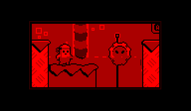

VUEngine Components: ReflectiveEntity
=====================================

An Entity that can mirror other parts of the virtual screen.

USAGE
-----

Add the following to the COMPONENTS variable in your project's `config.make` file to include this component:

	vuengine-components/entities/ReflectiveEntity 

See `source/ReflectiveEntity.h` for the available macros to configure the position of the low battery indicator on screen, its blinking interval or the interval between power checks. Define the desired macro in your game's `config.h` file to override. 