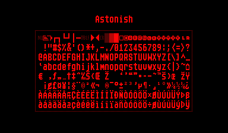

VUEngine Plugin: AstonishFont
=============================

A beautiful 8x16 pixel font for medium size text.

USAGE
-----

Included are two versions of the font:

- `ASTONISH_FONT` ("Astonish") contains the most important 96 characters (punctuation character, numbers and letters) plus control characters
- `ASTONISH_EXTENDED_FONT` ("AstonishExt") additionally contains the full set of European special characters

There's also a version of the font with dropshadows:

- `ASTONISH_FONT_SHADOW` ("AstonishS")
- `ASTONISH_EXTENDED_FONT_SHADOW` ("AstonishSExt")

Include the desired font versions in your `__FONTS` array.
