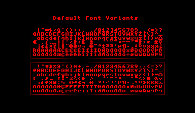

Variants of the default font that ships with VUEngine Core.

Included are bold and italic versions of the font which contains the most important 96 characters (punctuation character, numbers and letters) plus control characters. There's also "Ext" variants of both that additionally contains extended European characters.
