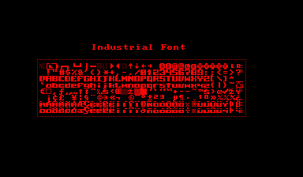

VUEngine Plugin: IndustrialFont
===============================

A bold, angular 8x8 pixel font that resembles industrial lettering.

USAGE
-----

Add the following to the PLUGINS variable in your project's `config.make` file to include this plugin:

	vuengine/plugins/fonts/Industrial

Included are two versions of the font:

- `INDUSTRIAL_FONT` ("Industrial") contains the most important 96 characters (punctuation character, numbers and letters) plus control characters
- `INDUSTRIAL_EXTENDED_FONT` ("IndustrialExt") additionally contains the full set of European special characters

Include the desired font versions in your `__FONTS` array.
