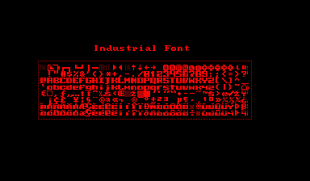

A bold, angular 8x8 pixel font that resembles industrial lettering.

## Usage

Included are two versions of the font:

- `IndustrialFont` contains the most important 96 characters (punctuation character, numbers and letters) plus control characters
- `IndustrialExtFont` additionally contains European characters
