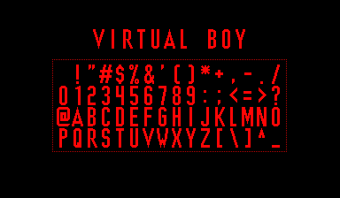

VUEngine Plugin: VirtualBoyFont
===============================

Large font based on the "Virtual Boy" writing from the official IPD/Focus adjustment screen.

USAGE
-----

Add the following to the PLUGINS variable in your project's `config.make` file to include this plugin:

	vuengine/plugins/fonts/VirtualBoyFont

Included are two versions of the font:

- `VIRTUAL_BOY_FONT` contains the most important 96 characters (punctuation character, numbers and letters)
- `VIRTUAL_BOY_EXTENDED_FONT` additionally contains the full set of European special characters

Include the desired font versions in your `__FONTS` array. Be warned that the extended font uses up a large portion of character memory (1440 chars!).