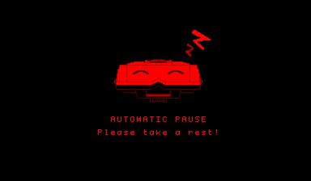

Automatically pauses the game every 30 minutes. Also comes with a default Automatic Pause Screen.

## Usage

For the automatic pause to work, you need to first activate it. The recommended way is to call the function `AutomaticPauseManager::setActive(AutomaticPauseManager::getInstance(), true);` from your game's main function before calling `VUEngine::start(VUEngine::getInstance(), …);`.

See `headers/Config.h` for numerous available macros that allow you to modify the auto pause screen appearance. Define the desired macro in your game's `Config.h` files to override.

You can set the desired delay before automatic pause (in minutes) with `setAutomaticPauseDelay(uint8 automaticPauseDelay)`. You can set another state to use as the automatic pause state with `setAutomaticPauseState(GameState automaticPauseState)`.
