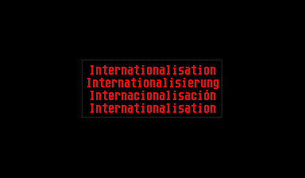

The Internationalization ("I18n") class allows you to add multiple selectable languages to your project.

## Usage

### Setting active language

You can set the active language using the `I18n::setActiveLanguage` method. Each registered language is identified by an integer in the order they were registered, starting with 0. By default, the first registered language is used.

    I18n::setActiveLanguage(I18n::getInstance(), 0);

Alternatively, you can also use the `I18n::setActiveLanguageByName` method to set the active language by one of the language names defined in your LangROMDefs.

    I18n::setActiveLanguageByName(I18n::getInstance(), "English");

### Getting a translated string

The `I18n::getText` method retrieves a string by a given identifier in the currently active language.

    I18n::getText(I18n::getInstance(), STR_HELLO);
