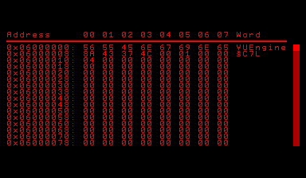

VUEngine Plugin: SaveDataManager
================================

Manages persistence of user data in SRAM.

USAGE
-----

Add the following to the PLUGINS variable in your project's `config.make` file to include this plugin:

	vuengine/plugins/other/SaveDataManager

You'll want to restore the previously saved settings for language and auto pause on startup. The recommended way is to call the function `SaveDataManager::initialize(SaveDataManager::restoreSettings());` from your game's main function before calling `Game::start(…);`.

See `source/config.h` for the available macros to modify the save manager's behavior. Define the desired macro in your game's `config.h` file to override.
