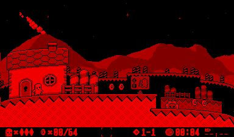

VUEngine Plugin: PostProcessingDwarfPlanet
==========================================

"Bends down" the left and right edges of the screen to make the world look like a very small planet. 

This effect reads and write a fourth of the screen and is therefore running OK-ish on hardware, reducing the frame rate by about 50%.

USAGE
-----

Add the following to the PLUGINS variable in your project's `config.make` file to include this plugin:

	vuengine/plugins/postProcessing/DwarfPlanet
	
Add to list of post processing effects of any stage or start manually using either `Game::pushFrontProcessingEffect` or `Game::pushBackProcessingEffect`. 
