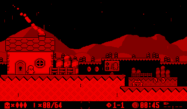

VUEngine Plugin: PostProcessingRain
===================================

Dynamic full screen rain effect. 

USAGE
-----

Add the following to the PLUGINS variable in your project's `config.make` file to include this plugin:

	vuengine/plugins/postProcessing/Rain

Add to list of post processing effects of any stage or start manually using either `Game::pushFrontProcessingEffect` or `Game::pushBackProcessingEffect`. 
