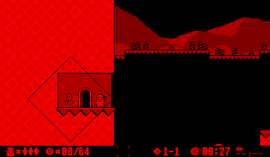

Draws a growing rhombus emitted from any Entity.
 
This effect only writes to the framebuffers, but does not read them. Since write access is much quicker than reading, and since only a few pixels are affected, this effect runs well on hardware. 

## Usage

Add to any Entity using either `VUEngine::pushFrontPostProcessingEffect` or `VUEngine::pushBackPostProcessingEffect`. 
