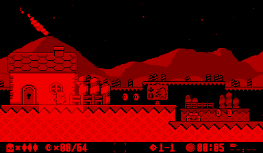

VUEngine Plugin: PostProcessingTest
===================================

Simple test effect that lights up a rectangular area around any SpatialObject.
 
Play with sources to modify the effect to add distortion and/or negate the image. 

USAGE
-----

Add the following to the PLUGINS variable in your project's `config.make` file to include this plugin:

	vuengine/plugins/postProcessing/Test

Add to any SpatialObject using either `Game::pushFrontProcessingEffect` or `Game::pushBackProcessingEffect`. 
