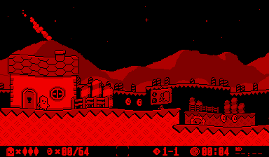

VUEngine Plugin: PostProcessingWobble
=====================================

Applies a full screen wobble distortion that is reminiscent of water waves. 

This effect reads and write almost the whole screen and is therefore not feasible on hardware. 

USAGE
-----

Add to list of post processing effects of any stage or start manually using either `Game::pushFrontProcessingEffect` or `Game::pushBackProcessingEffect`. 
