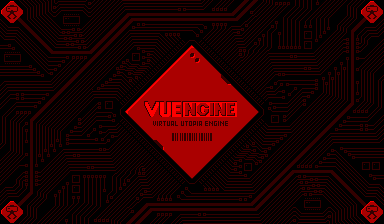

VUEngine Plugin: SplashScreens
==============================

A collection of default splash screens.
- Precaution screen
- IPD/Focus adjustment screen
- Automatic Pause selection screen
- Language selection screen

USAGE
-----

Add the following to the PLUGINS variable in your project's `config.make` file to include this plugin:

	vuengine/plugins/states/SplashScreens

See `source/config.h` for numerous available macros that allow you to modify the splash screens' appearance. Define the desired macro in your game's `config.h` file to override.

In addition, you can modify the screens' order through the `SplashScreenState::setNextState(…)` function. You will at least have to call that function on the language selection screen to define which state should be switched to after the splash screen sequence. The recommended way is to call the function from your game's main function before calling `Game::start(…);`.

**Dependency**: you will need to include the plugin `vuengine/plugins/other/AutomaticPause` for the automatic pause selection screen selection to have any effect.

**Dependency**: by also including the plugin `vuengine/plugins/other/SaveDataManager`, automatic pause and language selections will automatically be persisted in, and restored from, SRAM.
