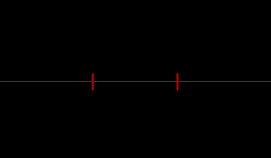

A recreation of Nintendo's official alignment check screen that can be used to check if the console's screens are out of alignment and need to be repaired. 

According to Nintendo's mandatory programming requirements, this screen should be accessible from a game's title screen by pressing the following button sequence:

- Right D-Pad Left
- B
- Right D-Pad Down
- A
- Right D-Pad Up

## Usage

Extend your title screen's State from `AlignmentCheckBaseGameState` instead of `GameState`. This abstract base state contains the checks for the button sequence to be entered.